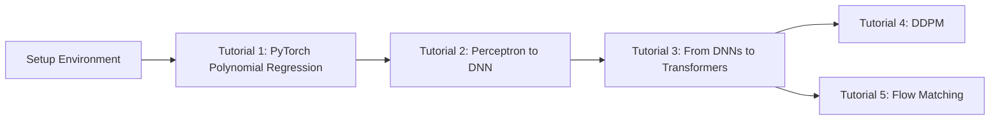

# Terascale 2026 Machine Learning Tutorials

Welcome to the machine learning tutorial series hosted at the **Terascale 2026 Statistics School**! This repository contains hands-on, educational tutorials designed to help you understand and implement modern machine learning methods using the PyTorch eco-system.

## Overview

This tutorial series introduces basic PyTorch usage for parameter estimation with regards to a polynomial fit, through to the latest generative methods,
such as diffusion & flow matching models. Each tutorial includes:

- Complete working code implementations
- Step-by-step Jupyter notebooks
- Detailed mathematical explanations
- Visualizations and animations
- Exercises and experiments

## Tutorials

### Tutorial 1: PyTorch Polynomial Regression

**Status:** Coming Soon

Simple introduction to PyTorch pythonic coding style, learning how to fit a polynomial function to data using regression.

**Planned Topics:**
- Simple PyTorch training loop
- Simple PyTorch `nn.` module for fitting polynomial `pytorch tensor parameters`
- Feature processing

[Start Tutorial 1](tutorials/tutorial-1.md){ .md-button .md-button--primary }

---

### Tutorial 2: Perceptron to DNN

**Status:** Coming Soon

Simple regression of polynomial functions using a universal approximator - i.e. the perceptron to Multi-layer Perceptron (MLP).

**Planned Topics:**
- Fit a polynomial function like in Tutorial 1, but not with a polynomial parameter based function, but a perceptron or MLP

[Start Tutorial 2](tutorials/tutorial-2.md){ .md-button .md-button--primary }

---

### Tutorial 3: From DNNs to Transformers

**Status:** Coming Soon

Learning with the same polynomial data how to train and understand the strengths and weaknesses of DNNs, CNNs and transformers.

**Planned Topics:**
- Fit DNN/CNN/Transformer to polynomial time forcasted data

[Coming Soon](tutorials/tutorial-3.md){ .md-button }

---

### Tutorial 4: Denoising Diffusion Probabilistic Models (DDPM)

**Status:** Available

Learn the foundations of diffusion models by implementing DDPM from scratch.

**Topics Covered:**
- Forward diffusion process (adding noise)
- Reverse diffusion process (denoising)
- Training a score-based model
- Sampling with various schedulers

[Start Tutorial 4](tutorials/tutorial-4.md){ .md-button .md-button--primary }

---

### Tutorial 5: Flow Matching

**Status:** Available

Explore flow matching as an alternative to stochastic diffusion models.

**Topics Covered:**
- Probability paths (linear vs variance preserving)
- Velocity field learning
- ODE-based sampling
- Comparison with DDPM

[Start Tutorial 5](tutorials/tutorial-5.md){ .md-button .md-button--primary }

---

## Quick Start

!!! tip "New to these tutorials?"
    1. Start with [Installation](installation.md) to set up your environment
    2. Follow the [Getting Started](getting-started.md) guide to clone and configure
    3. Begin with [Tutorial 1](tutorials/tutorial-1.md) for foundations

## Learning Path

## Prerequisites

- **Python 3.9+**: Modern Python installation
- **PyTorch 2.0+**: Deep learning framework
- **Basic ML Knowledge**: Understanding of neural networks and gradient descent
- **Linear Algebra**: Matrix operations, eigenvalues
- **Calculus**: Derivatives, gradients, probability

## Features

- **Hands-On Learning**: Complete working implementations you can run and modify
- **Interactive Notebooks**: Jupyter notebooks with step-by-step explanations
- **Visualizations**: Plots and animations to build intuition
- **Mathematical Rigor**: Clear mathematical explanations with LaTeX
- **Modular Code**: Clean, well-documented code you can reuse
- **Exercises**: Practice problems to reinforce learning

## System Requirements

=== "Minimum"
    - **CPU**: 2+ cores
    - **RAM**: 4 GB
    - **Storage**: 2 GB free space
    - **OS**: Linux, macOS, or Windows 10+

=== "Recommended"
    - **CPU**: 4+ cores or GPU
    - **RAM**: 8 GB+
    - **Storage**: 5 GB free space
    - **OS**: Linux or macOS
    - **GPU**: NVIDIA GPU with CUDA support (optional but faster)

## Support

If you encounter issues:

1. Check the [FAQ](faq.md)
2. Review [Troubleshooting](troubleshooting.md)
3. Open an issue on [GitHub](https://github.com/yourusername/generative-tutorials/issues)

## License

This project is licensed under the MIT License - see the LICENSE file for details.

## Acknowledgments

These tutorials are designed for educational purposes and draw inspiration from seminal papers:

- Ho et al. (2020) - Denoising Diffusion Probabilistic Models
- Lipman et al. (2023) - Flow Matching for Generative Modeling
- Song et al. (2021) - Score-Based Generative Modeling

---

Ready to start? Head to [Installation](installation.md) to set up your environment!
